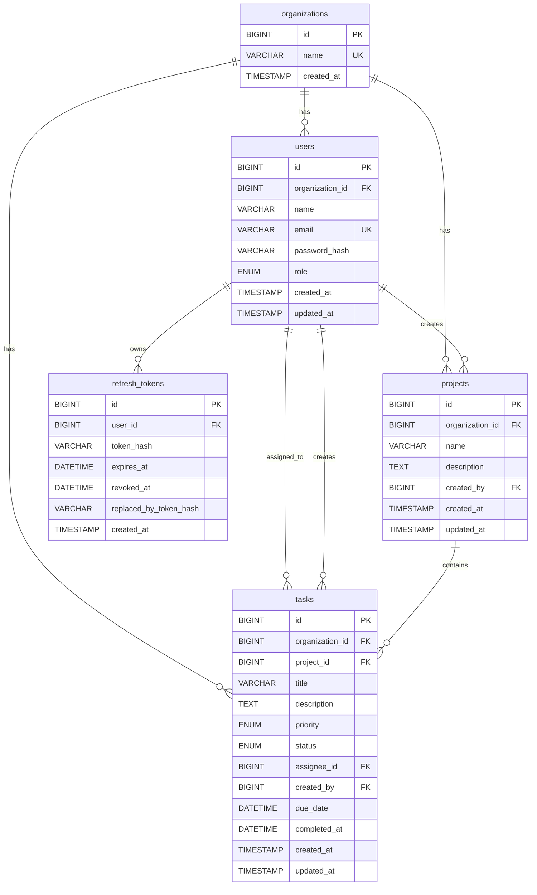

# Team Task Tracker API

A production-ready REST API for managing team-based tasks inside an organization. It includes JWT authentication, refresh token rotation, role-based access control, MySQL database design with indexes, Redis caching, Dockerized deployment, and a Postman collection for API testing.

---

## Tech Stack

- **Runtime**: Node.js (ESM)
- **Framework**: Express.js
- **Database**: MySQL 8.0
- **Cache**: Redis 7
- **Authentication**: JWT Access Token + Refresh Token Rotation
- **Validation**: Joi
- **Containerization**: Docker + Docker Compose
- **API Testing**: Postman Collection

---

## Features

- Register organization with first ADMIN user
- Login with JWT access token and refresh token
- Refresh token rotation with token revocation
- Role-based access control at middleware level
- User management by ADMIN
- Project management by ADMIN and MANAGER
- Task CRUD with assignment, priority, due date, and status workflow
- Member access restricted to assigned tasks
- Task list pagination and filtering
- Redis caching for task list API
- Cache invalidation on task mutations
- Analytics endpoint for overdue task count and average completion time
- Consistent error response format
- Docker setup for API + MySQL + Redis

---

## Roles and Permissions

| Permission | ADMIN | MANAGER | MEMBER |
|---|---:|---:|---:|
| Manage users | ✅ | ❌ | ❌ |
| Create/manage projects | ✅ | ✅ | ❌ |
| Create/assign tasks | ✅ | ✅ | ❌ |
| View tasks | ✅ | ✅ | Own assigned tasks only |
| Update task details | ✅ | ✅ | ❌ |
| Change task status | ✅ | ✅ | Own assigned tasks only |
| View analytics | ✅ | ✅ | ❌ |

RBAC is enforced at the route/middleware level using `authenticate` and `allowRoles()` middleware.

---

## Task Status Workflow

Task status transitions are enforced server-side. Direct/free-form status updates are rejected.

```text
TODO → IN_PROGRESS → IN_REVIEW → DONE
  ↘          ↘             ↘
              BLOCKED

BLOCKED → IN_PROGRESS
DONE    → terminal state
```

Allowed transitions:

| Current Status | Allowed Next Status |
|---|---|
| TODO | IN_PROGRESS, BLOCKED |
| IN_PROGRESS | IN_REVIEW, BLOCKED |
| IN_REVIEW | DONE, BLOCKED |
| BLOCKED | IN_PROGRESS |
| DONE | No further transition |

---

## Quick Start with Docker

> Prerequisite: Docker and Docker Compose must be installed.

```bash
git clone <your-repo-url>
cd Team-Task-Tracker
docker compose up --build
```

The API will be available at:

```text
http://localhost:3000
```

Health check:

```http
GET http://localhost:3000/health
```

MySQL is exposed on local port `3307`, Redis is exposed on local port `6379`.

The database schema is auto-applied on first boot using Docker MySQL init script:

```text
src/db/schema.sql → /docker-entrypoint-initdb.d/01_schema.sql
```

---

## Environment Variables

Create `.env` in the project root. The values below work with `docker-compose.yml`.

```env
PORT=3000

DB_HOST=mysql
DB_PORT=3306
DB_USER=task_user
DB_PASSWORD=task_pass
DB_NAME=task_tracker

REDIS_HOST=redis
REDIS_PORT=6379

JWT_ACCESS_SECRET=change_access_secret
JWT_REFRESH_SECRET=change_refresh_secret
ACCESS_TOKEN_TTL=15m
REFRESH_TOKEN_DAYS=7
```

For local non-Docker development, update `DB_HOST`, `REDIS_HOST`, and credentials according to your local setup.

---

## Local Development

```bash
npm install
npm run dev
```

For normal start:

```bash
npm start
```

---

## Database Schema

### ER Diagram

GitHub supports Mermaid diagrams in Markdown, so this diagram will render directly in `README.md`.



### Main Relationships

- One organization has many users.
- One organization has many projects.
- One organization has many tasks.
- One user can create many projects.
- One user can create many tasks.
- One user can be assigned many tasks.
- One user can have many refresh tokens.
- One project can contain many tasks.

---
## Schema Description

The database is designed around organization-level data isolation. Each organization has its own users, projects, and tasks.

### Tables

- `organizations`: Stores organization details.
- `users`: Stores users belonging to an organization. Each user has a role: ADMIN, MANAGER, or MEMBER.
- `refresh_tokens`: Stores hashed refresh tokens for refresh token rotation and logout support.
- `projects`: Stores projects created inside an organization.
- `tasks`: Stores tasks assigned to users within an organization and optionally linked to a project.

### Relationships

- One organization has many users.
- One organization has many projects.
- One organization has many tasks.
- One user can have many refresh tokens.
- One user can create many projects.
- One user can create many tasks.
- One user can be assigned many tasks.
- One project can have many tasks.

### Indexing Decision

Indexes are added on frequently queried task fields such as `status`, `assignee_id`, and `due_date`. Since every request is scoped by organization, composite indexes start with `organization_id`.

Important indexes:

- `(organization_id, status)`
- `(organization_id, assignee_id)`
- `(organization_id, due_date)`
- `(organization_id, assignee_id, status, priority, due_date)`

These indexes improve performance for task listing, filtering, pagination, and analytics queries.

---

## Redis Caching Strategy

### What is cached?

The task list endpoint is cached in Redis because it is a frequently accessed read-heavy API.

```http
GET /api/tasks?page=1&limit=10&status=TODO&priority=HIGH&assignee=5
```

### Cache key format

```text
tasks:list:org:{orgId}:assignee:{assigneeId|all}:page:{page}:limit:{limit}:status:{status|all}:priority:{priority|all}
```

Example:

```text
tasks:list:org:1:assignee:5:page:1:limit:10:status:TODO:priority:HIGH
```

### TTL

Task list cache is stored with a **120 seconds TTL**.

```js
await redis.set(key, JSON.stringify(payload), 'EX', 120);
```

### Invalidation strategy

Cache is invalidated whenever a task is:

- Created
- Updated
- Deleted
- Reassigned
- Status changed

The invalidation clears:

1. Organization-wide task list cache: `assignee:all`
2. Specific assignee task list cache

Redis `SCAN` is used instead of `KEYS` to avoid blocking Redis on large keyspaces.

This gives better consistency than TTL-only caching because users do not see stale task lists after write operations.

---

## API Endpoints

Base URL:

```text
http://localhost:3000/api
```

### Authentication

| Method | Endpoint | Access | Description |
|---|---|---|---|
| POST | `/api/auth/register` | Public | Create organization and first ADMIN user |
| POST | `/api/auth/login` | Public | Login and receive access/refresh tokens |
| POST | `/api/auth/refresh` | Public | Rotate refresh token and issue new token pair |
| POST | `/api/auth/logout` | Public | Revoke refresh token |

### Users

| Method | Endpoint | Access | Description |
|---|---|---|---|
| POST | `/api/users` | ADMIN | Create MANAGER or MEMBER |
| GET | `/api/users` | ADMIN | List organization users |
| GET | `/api/users/:id` | ADMIN | Get user by id |
| PATCH | `/api/users/:id` | ADMIN | Update user name or role |
| DELETE | `/api/users/:id` | ADMIN | Delete user |

### Projects

| Method | Endpoint | Access | Description |
|---|---|---|---|
| POST | `/api/projects` | ADMIN, MANAGER | Create project |
| GET | `/api/projects` | ADMIN, MANAGER, MEMBER | List projects in organization |
| PUT | `/api/projects/:id` | ADMIN, MANAGER | Update project |
| DELETE | `/api/projects/:id` | ADMIN, MANAGER | Delete project |

### Tasks

| Method | Endpoint | Access | Description |
|---|---|---|---|
| POST | `/api/tasks` | ADMIN, MANAGER | Create task |
| GET | `/api/tasks` | All roles | List tasks with pagination, filters, and Redis cache |
| GET | `/api/tasks/:id` | All roles | Get task detail |
| PATCH | `/api/tasks/:id` | ADMIN, MANAGER | Update task fields |
| PATCH | `/api/tasks/:id/status` | ADMIN, MANAGER, Assignee | Change task status |
| DELETE | `/api/tasks/:id` | ADMIN, MANAGER | Delete task |

List tasks query example:

```http
GET /api/tasks?page=1&limit=10&status=TODO&priority=HIGH&assignee=5
```

### Analytics

| Method | Endpoint | Access | Description |
|---|---|---|---|
| GET | `/api/tasks/analytics/overdue` | ADMIN, MANAGER | Overdue task count per user and average completion time |

---

## Sample Error Response

All errors follow a consistent JSON structure:

```json
{
  "status": 400,
  "code": "VALIDATION_ERROR",
  "message": "due_date must be a future date"
}
```

---

## Postman Collection

Import the Postman collection from:

```text
postman/Team-Task-Tracker-Api.postman_collection.json
```

The collection includes requests for:

- Auth
- Users
- Projects
- Tasks
- Task filters
- Status transition flow
- Analytics

The Login request stores `token` and `refreshToken` automatically for protected APIs.

Recommended execution order:

```text
Health Check
Register
Login
Create User
Create Project
Create Task
Get Tasks
Get Tasks With Multiple Filters
Get Task By Id
Update Task
Change Status: TODO → IN_PROGRESS
Change Status: IN_PROGRESS → IN_REVIEW
Change Status: IN_REVIEW → DONE
Analytics
Logout
```

---

## Folder Structure

```text
Team-Task-Tracker/
├── Dockerfile
├── docker-compose.yml
├── package.json
├── postman/
│   └── Team-Task-Tracker-Api.postman_collection.json
└── src/
    ├── config/
    │   ├── db.js
    │   └── redis.js
    ├── controllers/
    ├── db/
    │   └── schema.sql
    ├── middlewares/
    ├── routes/
    ├── services/
    ├── utils/
    ├── validators/
    └── server.js
```
---

## Author

Girraj Singhal
